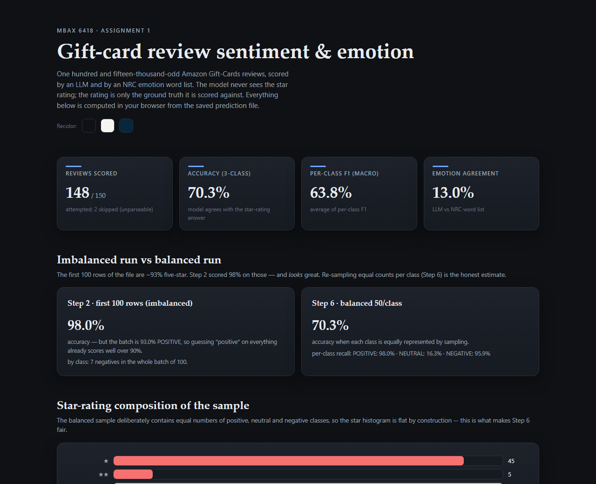
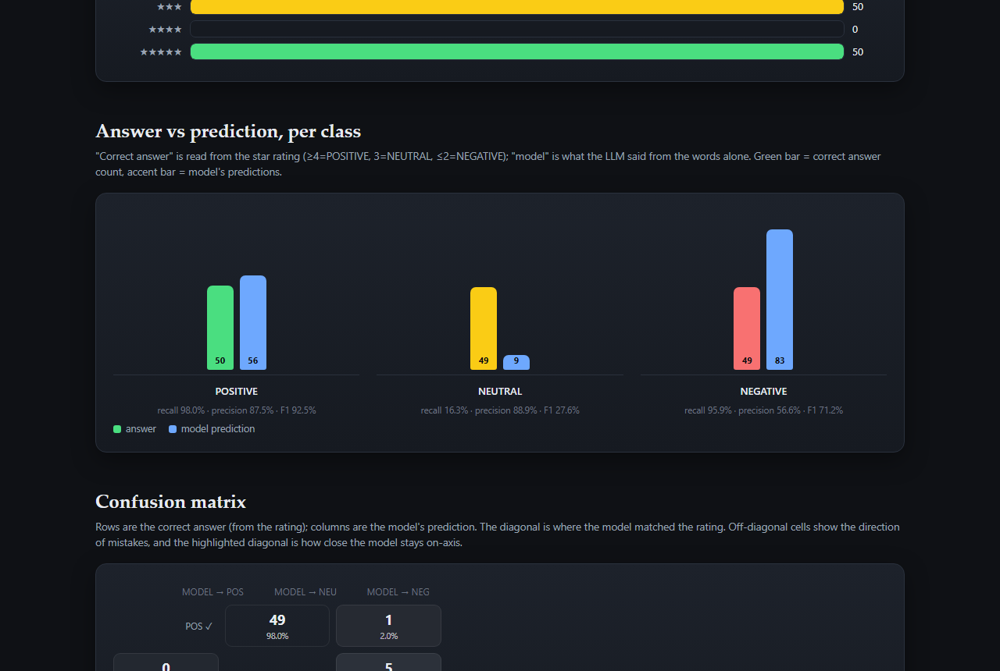
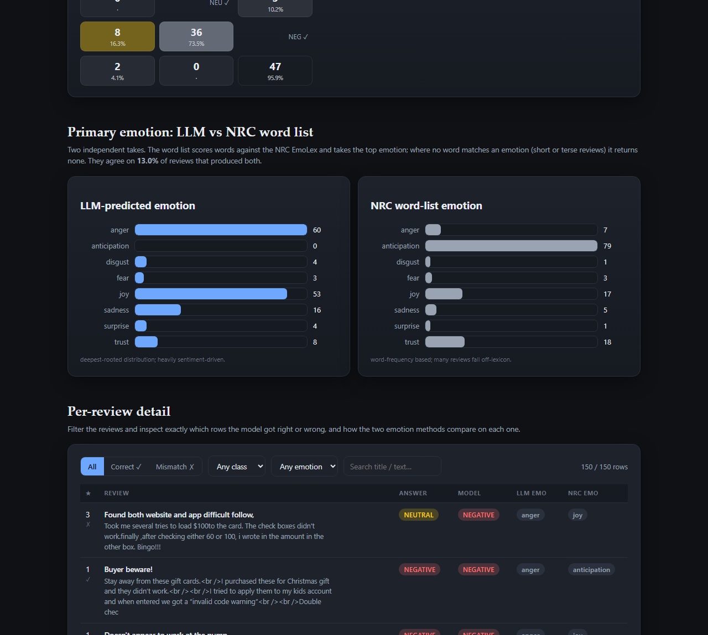
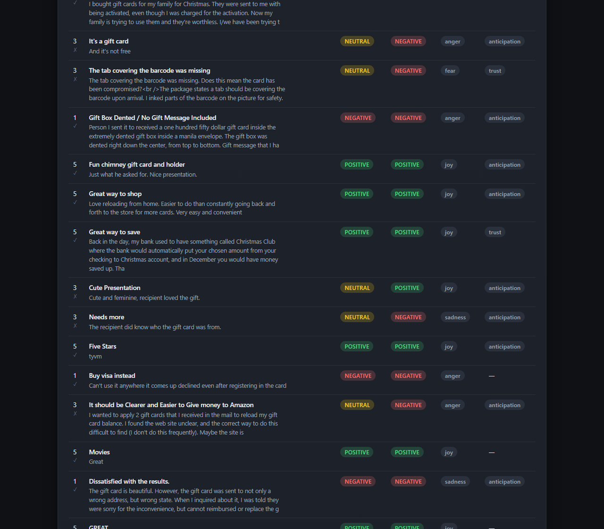

# MBAX 6418 — Assignment 1: Sentiment & Emotion Classification of Gift-Card Reviews

A zero-shot LLM sentiment classifier for Amazon **Gift Cards** reviews. The model reads only the
review's **title + text** and returns a sentiment class **and** a primary emotion. It never sees the
star rating — the rating is only the ground truth it is later scored against. A second,
model-free pipeline scores the same reviews against the **NRC Word-Emotion Association Lexicon**
(EmoLex) to produce an independent emotion take, and the two are compared.

Everything is rendered in a single self-contained HTML dashboard (no server, no network at run time).

---

## The data

- **Dataset:** Amazon Reviews '23 (McAuley Lab, UC San Diego) — the "Gift_Cards" review category.
- **Source / citation:** [https://amazon-reviews-2023.github.io](https://amazon-reviews-2023.github.io)
- **Raw file:** `Gift_Cards.jsonl.gz` from the Amazon '23 hosted set
  ([mcauleylab.ucsd.edu/public_datasets/.../Gift_Cards.jsonl.gz](https://mcauleylab.ucsd.edu/public_datasets/data/amazon_2023/raw/review_categories/Gift_Cards.jsonl.gz))
- **Size:** 152,410 reviews. Fields: `rating` (1–5), `title`, `text`, `verified_purchase`,
  `helpful_vote`, `timestamp`, `images`, `asin`, `parent_asin`, `user_id`.

> The dataset is **heavily skewed**: ★★★★★ makes up ~84% of all reviews (128,248 of 152,410),
> ★★★★ ~4%, ★★★ ~2%, ★★ ~1%, ★ ~8%. The first 100 rows in file order are ~93% ★★★★★ — this skew
> is the whole story behind Question 1 below and is why a *balanced* sample is used for scoring.

## Repository layout

| File | Purpose |
|---|---|
| `prompt.py` | The rating-blind structured prompt (Step 1 deliverable) |
| `classify.py` | Loads data, samples, calls the LLM, scores vs the rating (Steps 2 & 6) |
| `emotion_wordlist.py` | NRC EmoLex word-list scorer (Step 5 deliverable) |
| `make_dashboard.py` | Generates `dashboard.html` from the saved predictions (Steps 3, 4, 7) |
| `dashboard.html` | The final dashboard (generated; one self-contained offline page) |
| `data/step6_balanced.jsonl` | The balanced run's raw output (the deliverable "raw output") |
| `data/step2_first100.jsonl` | The imbalanced first-100 batch output |
| `data/img/*.png` | Screenshots used in this report |
| `requirements.txt` | `openai`, `PyYAML`, `NRClex` |

Run: `pip install -r requirements.txt`, then `python classify.py step2`, `python classify.py step6`,
`python make_dashboard.py`. The endpoint/model/key are auto-discovered from the local Hermes config so
the script talks to the same OpenAI-compatible endpoint used to build this project
(`DeepSeek-V4-Flash-0731`). To reproduce exactly: **seed = 42**, shared for both samples.

---

## Step 2 — Imbalanced first-100 batch (binary)

Took the **first 100 rows** in file order — deliberately lopsided. Ground truth from rating:
`>=4 → POSITIVE`, else `NEGATIVE`.

| | value |
|---|---|
| Batch composition | **93 POSITIVE / 7 NEGATIVE** |
| Overall accuracy | **98.0%** (98/100) |
| Positive class accuracy | 98.9% (92/93) |
| Negative class accuracy | 85.7% (6/7) |

Confusion (rows = answer, cols = model):

| | POSITIVE | NEGATIVE |
|---|---|---|
| POSITIVE | 92 | 1 |
| NEGATIVE | 1 | 6 |

This run **looks excellent**, but it flatters the model. Because 93% of the batch is one class, a
dumb "always say POSITIVE" baseline already scores 93%; the model adds only ~5 points on top. Any
worth reading of the model's real accuracy needs a balanced group.

---

## Step 6 — Balanced three-class run (the honest numbers)

Class-balanced sample of **150** from the whole file: ~50 per class, picked with a fixed random seed.
Classes: `>=4 → POSITIVE`, `3 → NEUTRAL`, `<=2 → NEGATIVE`. The model never saw the rating.

- Attempted 150, skipped **2** (unparseable API responses even after retries), scored **148**.
- **Overall accuracy: 70.3% (104/148)** — far below the Step-2 98%.
- Macro-F1: **63.8%** (POSITIVE 92.5% · NEUTRAL 27.6% · NEGATIVE 71.2%).

Per-class accuracy (how often the model picked the right class):

| Class | n | correct | class accuracy |
|---|---|---|---|
| POSITIVE | 50 | 49 | **98.0%** |
| NEUTRAL | 49 | 8 | **16.3%** |
| NEGATIVE | 49 | 47 | **95.9%** |

Confusion (rows = answer, cols = model):

| | POSITIVE | NEUTRAL | NEGATIVE |
|---|---|---|---|
| POSITIVE | 49 | 1 | 0 |
| NEUTRAL | 5 | 8 | **36** |
| NEGATIVE | 2 | 0 | 47 |

---

## The four questions the assignment asks

### 1. Why did the lopsided run look very accurate, and what did balancing change?

The Step-2 batch was ~93% ★★★★★. The model agreed with the rating on 98% of rows mostly because
nearly every row *is* positive — an always-positive baseline is already 93%. Balancing removed that
crutch: a random guess on the balanced three-class set is ~33%, and the model lands at **70.3%** —
genuine signal, but a very different picture than 98%. Balancing also gave the ★★★ class enough mass
to fail visibly instead of being hidden inside the positive majority.

### 2. Which classes get confused with which, and in what direction?

The model is strong at the *poles* and collapses at the *middle*:

- **39 of 49 ★★★ reviews were not labeled NEUTRAL**: **36 were labeled NEGATIVE** (73.5%) and 5
  POSITIVE. Only 8 of 49 got NEUTRAL right.
- The reverse direction almost never happens: **0 negatives** were called neutral and only 1 positive
  was called neutral.
- Net: the model **over-emits NEGATIVE**. Predicted counts were POSITIVE 56, NEUTRAL **9**, NEGATIVE
  **83** against true 50/49/49 — it buckets ★★★ reviews as negative far more often than as neutral,
  because terse/mixed ★★★ reviews ("It's a gift card", "GREAT", "Fairly Nice") read to the model as
  neutral-ish-but-complaining, and a three-star review with any complaint is pushed to NEGATIVE.

### 3. How do the LLM's emotions differ from the word list's, and why?

They agree on only **13.0%** (17/131) of reviews that produced both emotions. The two distributions
are almost orthogonal:

| emotion | LLM-predicted | NRC word list |
|---|---|---|
| anger | 60 | 7 |
| joy | 53 | 17 |
| sadness | 16 | 5 |
| trust | 8 | 18 |
| surprise | 4 | 1 |
| disgust | 4 | 1 |
| fear | 3 | 3 |
| anticipation | **0** | **79** |

**Why.** The LLM is *reasoning over the whole review* and ties emotion to the overall
valence/sentiment — negative reviews come out `anger`/`sadness`, positive ones `joy`; it essentially
mirrors the sentiment class, so it rarely says `anticipation`. The word list is a *static
word → emotion dictionary revisited word by word*, unaware of context: everyday Gift-Cards words
(`get`, `got`, `buy`, `give`, `gift`, `want`) are tagged `anticipation` in NRC regardless of how they
are used, which is why `anticipation` dominates with 79. The word list also returns **no emotion for
17 short/terse reviews** (e.g. "GREAT", "Good") that match no lexicon emotion. So: the LLM answers in
*why the review feels the way it does*; the word list answers in *which emotion words happen to
appear*. Both are reasonable, but they measure different things.

### 4. Bugs / issues hit along the way, and workarounds

- **Reasoning model returns empty text.** `DeepSeek-V4-Flash` spends output tokens on a `reasoning`
  field first; with the original `max_tokens=10` the `content` came back `None`. **Fix:** raise to
  `max_tokens=512` and retry up to 3× on empty/unparseable replies (drops failures to 2/150).
- **Config is YAML, not JSON.** Reading the Hermes config for the endpoint/key exploded the first
  time. **Fix:** `yaml.safe_load` with a JSON fallback.
- **Wrong Python on PATH.** `pip` installed into a system Python 3.13 while the project runs on the
  uv 3.11 venv (which has no `pip` module). **Fix:** `uv pip install --python <venv> ...`.
- **A single bad reply crashed the run.** One unparseable prediction produced `sentiment=None` and a
  `KeyError: None` in the confusion matrix *after* the model calls were done. **Fix:** treat null
  predictions as "skipped," report their count, and exclude them from scoring instead of crashing.
- **NRC lemmatization needed downloads.** TextBlob's lemmatize path required nltk corpora
  (network). **Fix:** a tiny offline suffix-lemmatizer in `emotion_wordlist.py`; keeps the scorer
  fully reproducible with no downloads.
- **Chart-collapse risk (Step 7 warning).** Bars get a `min-width` guard so a small/fractional
  value still renders a visible sliver instead of a zero-width bar.
- **Walrus-in-f-string / JS typos.** A `:=` inside an f-string is 3.12-only, and the template had a
  stray invalid JS fragment. **Fix:** plain assignment and removing the fragment; verified by reading
  the rendered DOM and checking in-browser numbers against the saved file.
- **Screenshotting.** The interactive browser harness wanted a manual "allow remote debugging" click,
  and the endpoint's model isn't multimodal. **Fix:** drove real headless Chrome to render the page
  and verified the chart pixels programmatically.

---

## Primary-emotion detection (Step 5)

Two independent takes on each review's primary emotion:

1. **LLM** (extended prompt output — sentiment *and* emotion).
2. **Word list** — score each review's words against the NRC EmoLex (8 emotions), take the highest.

Both are kept and compared; see Question 3 for the divergence and the reasoning.

---

## The dashboard (Steps 3, 4, 7)

A single file, **`dashboard.html`**, works fully offline (no server, no CDN). It is driven entirely
by `data/step6_balanced.jsonl`, computing every figure in the browser from the same file the saved
summary came from — so the on-page numbers cannot drift from the raw output. It includes headline
metrics, an imbalanced-vs-balanced comparison, a star-rating distribution, answer-vs-prediction
bars, a 3×3 confusion matrix, LLM-vs-word-list emotion charts, and an interactive review table that
filters to correct/mismatched rows, by class and by emotion, with a live count. The whole theme is
defined by CSS custom properties and can be recolored in one click.

Interface screenshots:

---

## Reproducibility

- Fixed random **seed = 42** for both samples (same reviews every run).
- Fixed model (`DeepSeek-V4-Flash-0731`, temperature 0) and fixed prompt (`prompt.py`).
- The saved predictions in `data/*.jsonl` are the literal source of every number in this report and
  in the dashboard — re-running reproduces them.
- The raw 152K-review source file is *not* committed (large, re-downloadable); the small sampled
  outputs are.
